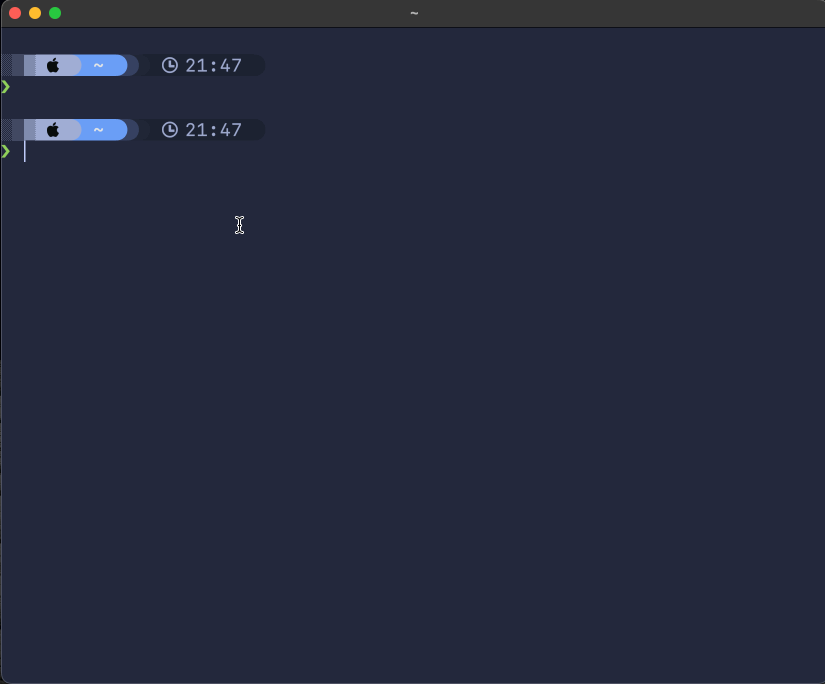
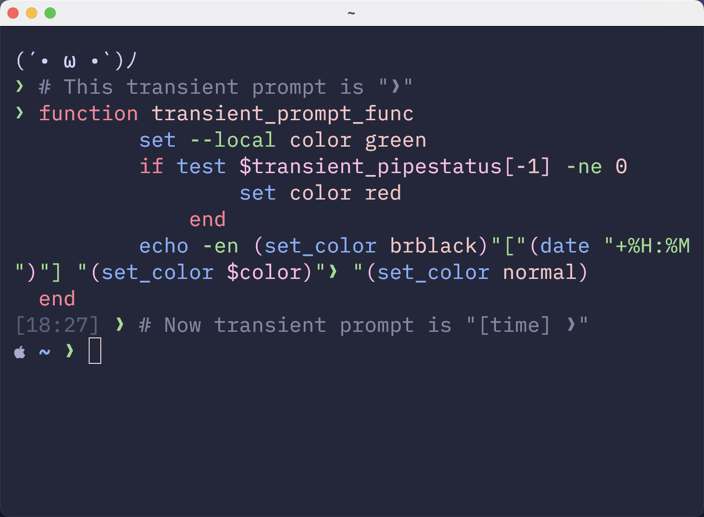
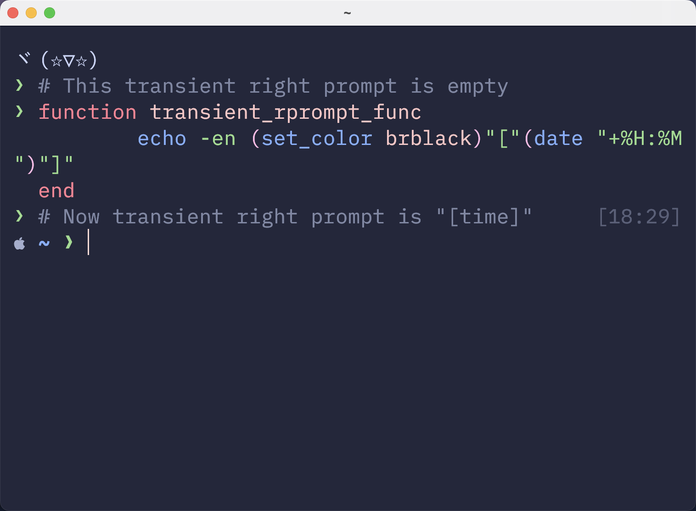

Transient Prompt
===


  * [Installation](#installation)
  * [Features](#features)
  * [Configuration](#configuration)
     * [transient_prompt_func](#transient_prompt_func)
     * [transient_rprompt_func](#transient_rprompt_func)
  * [Inspiration](#inspiration)

# Installation
Installation with [fisher](https://github.com/jorgebucaran/fisher):
```fish
fisher install zzhaolei/transient.fish
```

# Features
A picture is worth a thousand words.



**Tip**: If you enable transient prompt, take advantage of two-line prompt. You'll get the benefit of extra space for typing commands without the usual drawback of reduced scrollback density. Sparse prompt (with an empty line before prompt) also works great in combination with transient prompt.

# Configuration

Support `transient_status` and `transient_pipstatus` variables, which are aliases of `status` and `pipstatus`.

## transient_prompt_func
Define the `transient_prompt_func` function. In this function, you can do what you want.

Example:


## transient_rprompt_func
Define the `transient_rprompt_func` function. In this function, you can do what you want.

Example:
 

# Inspiration
 - [powerlevel10k#transient-prompt](https://github.com/romkatv/powerlevel10k#transient-prompt)
