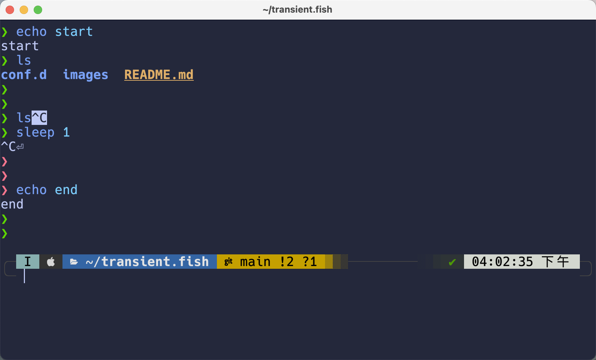
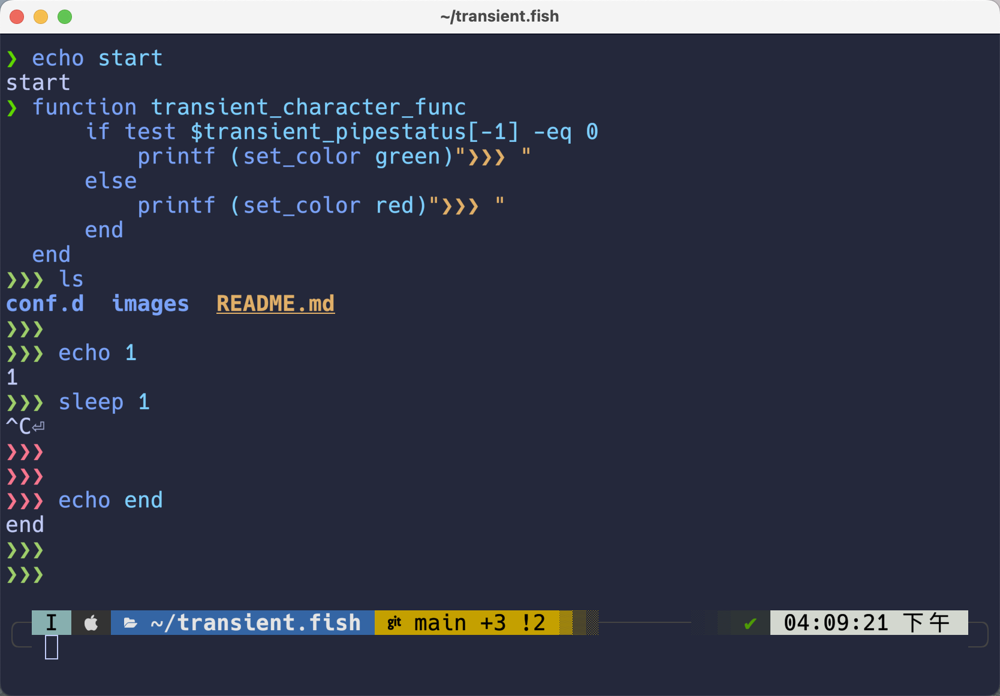

# Transient Prompt By Fish Shell

## Install
```fish
fisher install zzhaolei/transient.fish
```

## Configuration

### transient character
You can set the `transient_character_func` function, customize the `transient character`.

You can adjust the color of the prompt using `transient_pipestatus` or `transient_status`

Example:

- before


- after


## Known Issue
