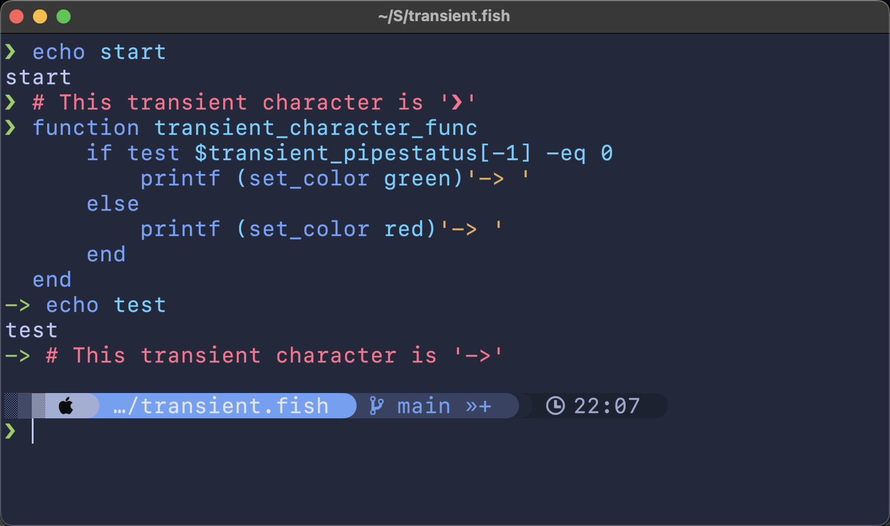

# Transient Prompt

When we have a gorgeous terminal prompt, the terminal will be flooded with these prompts, which will obviously affect our attention to more critical data, such as the execution results of git commands.

The goal of this plugin is to reduce the distraction of these prompts.

This will also make it easier to scroll back and copy-paste a series of commands from the terminal.


## Install
```fish
fisher install zzhaolei/transient.fish
```

## Configuration

Using the `transient_character_func` function, you can set any prompt symbol you like.

In the transient_character_func function, you can do what you want with `transient_pipestatus` or `transient_status`

Example:



## Known Issues
 - When a time-consuming task is executed(such as sleep), press the `Enter` key, the transient prompt does not work properly

## Inspiration
 - [powerlevel10k#transient-prompt](https://github.com/romkatv/powerlevel10k#transient-prompt)
